# SPA開発入門 演習ガイド

**～Vue・Reactを学ぶ前に！素のJavaScriptで理解するSPA～**

---

## この演習ガイドについて

この演習ガイドでは、講義資料「SPA開発入門」で学習する第1章から第4章までの内容を、「人事管理システム」の作成を通して定着させます。第1章で社員情報を画面に表示し、第2章で非同期通信を学び、第3章で社員情報を管理するREST APIを作成し、第4章でSPAへ発展させます。

演習では、次の3フォルダを使用します。 `sample` を参照しながら `exercise_question` の問題を解き、動作確認後に `exercise_sample` と比較してください。

```text
sample/             メインテキストで使用する参照サンプル
exercise_question/  受講者が編集する問題ファイル
exercise_sample/    コメントで詳しく解説した演習の完成解答
```

`exercise_question` と `exercise_sample` は同じ相対パス・ファイル名で対応させます。例えば、問題が `exercise_question\Ex1-4\innerHTML.html` の場合、完成解答は `exercise_sample\Ex1-4\innerHTML.html` です。

各問題は、参照サンプルの題材・データ・関数名を人事管理向けに変更しています。ただし、解答に必要な構文やAPIは、記載された参照テキストと参照ファイルで学習した範囲に限定しています。

### 演習を始める前の注意

- HTMLファイルは、VS CodeのLive Serverなど、ローカルWebサーバーから開いてください。
- APIを使用する演習では、対象の `api` フォルダで `npm start` または `npm run dev` を実行してください。
- `exercise_question` と `exercise_sample` のAPIは、起動前に `npm install` が自動実行されるため、nodemonなどの依存関係も自動でインストールされます。
- APIサーバーを起動したターミナルは、演習中に閉じないでください。
- ブラウザの開発者ツールを開き、ConsoleとNetworkを確認しながら進めてください。
- データベースを使用する演習では、必要に応じて演習前の `employees.db` を複製しておいてください。
- 問題文にない機能は追加せず、指定された動作を一つずつ確認してください。

### この演習で使用するデータ

第3章と第4章では、SQLiteの `employee` テーブルを使用します。第1章と第2章も社員情報や人事業務を題材とし、4章を通して人事管理システムを段階的に作成します。

| 列名 | 内容 | 例 |
|---|---|---|
| `id` | 社員番号 | `1001` |
| `password` | パスワード | `password` |
| `name` | 氏名 | `山田太郎` |
| `salary` | 給与 | `230000` |
| `location_name` | 勤務地 | `東京` |
| `image_path` | 社員画像のパス | `../images/1001.png` |

`image_path` は、各演習HTMLファイルから見た画像ファイルへの相対パスです。たとえば `Ex3-6/update.html` から `images/1001.png` を表示する場合、画像フォルダは1つ上の階層にあるため `../images/1001.png` とします。

> **注意:** パスワードは演習用の簡易データです。実際のシステムでは平文で保存しません。

## 目次

1. [演習1 JavaScriptのDOMプログラミング](#演習1-javascriptのdomプログラミング)
2. [演習2 非同期通信](#演習2-非同期通信)
3. [演習3 REST API](#演習3-rest-api)
4. [演習4 SPA開発](#演習4-spa開発)

---

# 演習1 JavaScriptのDOMプログラミング

## 演習の目標

- 関数宣言、関数式、アロー関数を使い分けられる
- 引数と戻り値を持つ関数を記述できる
- id、class、タグ名を使ってDOM要素を選択できる
- HTML属性と `addEventListener` を使ってイベント処理を実装できる
- `innerHTML`、`insertAdjacentHTML`、`classList` を使って画面を動的に変更できる

## 演習の概要

第1章で学習したJavaScriptの関数、DOM選択、イベント処理、動的レンダリングを、社員情報の表示や勤務状態の切り替えを題材に確認します。最後に「ユーザー操作をきっかけに社員情報の表示を更新する」一連の流れを説明できる状態を目指します。

## 予想所要時間

約45分

## 演習1.1 関数の定義と呼び出し

### 演習1.1.1 関数宣言と関数式

**参照テキスト**  
1.1.1. 関数の定義と呼び出し方法

**参照ファイル**  
`sample\Ex1-1\function_basic.html`

**演習ファイル**  
`exercise_question\Ex1-1\function_basic.html`

1. `showSystemName` 関数を関数宣言で定義してください。
2. 関数内で `document.write` を使用し、「人事管理システム」と表示してください。
3. 定義した `showSystemName` 関数を呼び出してください。
4. `showOperationGuide` 関数を関数式で定義してください。
5. 関数内で「社員メニューを選択してください」と表示してください。
6. 定義した `showOperationGuide` 関数を呼び出してください。

#### 動作確認

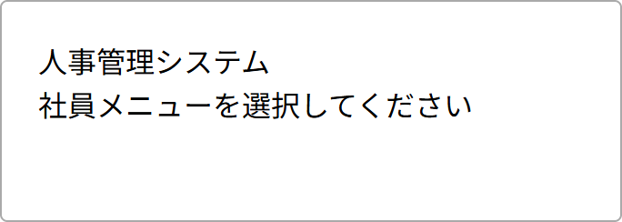

- ブラウザに2種類のメッセージが表示されること
- Consoleにエラーが表示されていないこと
- 関数宣言と関数式の記述位置を入れ替えた場合の違いを説明できること

### 演習1.1.2 引数と戻り値を持つ関数

**参照テキスト**  
1.1.2. 引数と戻り値を持つ関数

**参照ファイル**  
`sample\Ex1-1\function_return.html`

**演習ファイル**  
`exercise_question\Ex1-1\function_return.html`

1. 月給と賞与を引数として受け取る `calculateAnnualIncome` 関数を定義してください。
2. 「月給×12＋賞与」の計算結果を `return` で返してください。
3. `calculateAnnualIncome` 関数を呼び出します。月給230,000円、賞与400,000円を渡し、戻り値を変数 `annualIncome` に代入してください。
4. 年収見込額を画面へ表示してください。

#### 動作確認


- ブラウザに「年収見込額：3160000円」と表示されること
- 月給または賞与を変更すると、表示される年収見込額も変わること

### 演習1.1.3 アロー関数

**参照テキスト**  
1.1.3. アロー関数(ラムダ式)

**参照ファイル**  
`sample\Ex1-1\function_arrow.html`

**演習ファイル**  
`exercise_question\Ex1-1\function_arrow.html`

最初に、社員番号と氏名を受け取り、「1001：山田太郎」の形式で返す関数式を確認してください。

1. 同じ処理を行う `formatEmployee` をアロー関数で定義してください。
2. `formatEmployee(1001, '山田太郎')` の結果を画面に表示してください。

#### 動作確認


- ブラウザに「1001：山田太郎」と表示されること
- `function` を使う関数式とアロー関数の構文上の違いを説明できること

## 演習1.2 DOMの選択

**参照テキスト**  
1.2. DOM の選択

**参照ファイル**  
`sample\Ex1-2\dom_select.html`

**演習ファイル**  
`exercise_question\Ex1-2\dom_select.html`

1. idが `employeeName` の社員名要素を選択してください。
2. classが `work-location` の勤務地要素をCSSセレクターで選択してください。
3. すべてのボタン要素を選択してください。
4. 既存の `console.log` と `forEach` を使い、選択した要素の文字列を確認してください。

#### 動作確認

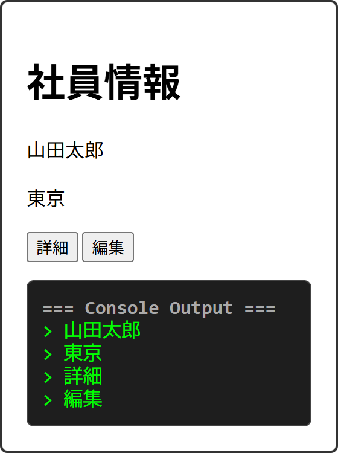

- VSCodeからブラウザを開いて、開発者モード(F12)でコンソールを開くこと
- Consoleに社員名、勤務地、各操作ボタンの文字列が表示されること
- 1件を選択するメソッドと複数件を選択するメソッドの戻り値の違いを説明できること

## 演習1.3 イベントハンドリング

### 演習1.3.1 HTML属性でイベントを割り当てる

**参照テキスト**  
1.3. イベントハンドリング

**参照ファイル**  
`sample\Ex1-3\event_listener1.html`

**演習ファイル**  
`exercise_question\Ex1-3\event_listener1.html`

1. [出勤する]ボタンにクリック時のイベント属性を追加してください。
2. クリック時に `showWorkStartMessage()` が呼び出されるようにしてください。
3. 関数内で「出勤を受け付けました」とアラート表示してください。

#### 動作確認

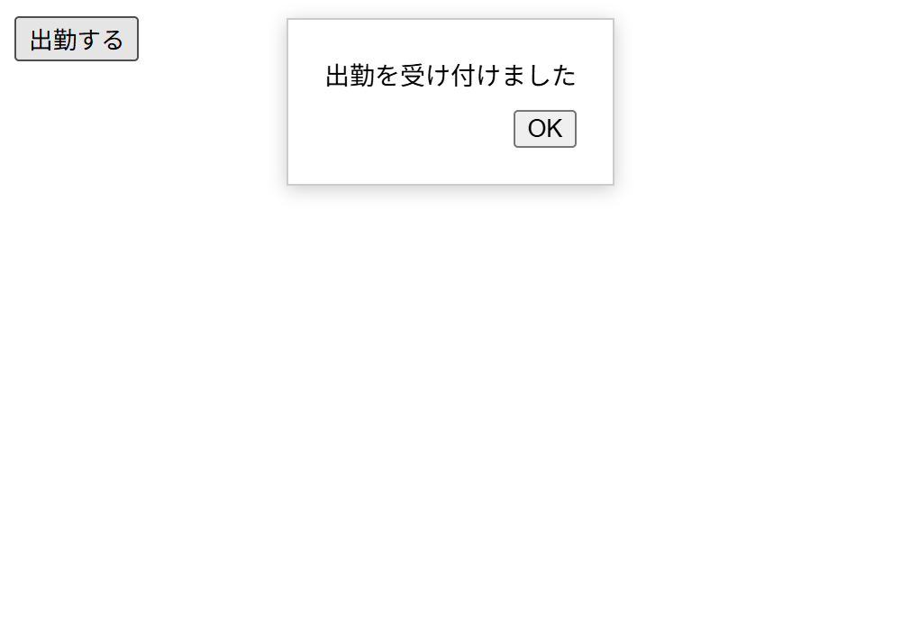

- [クリック]ボタンを押すとアラートが1回表示されること

### 演習1.3.2 addEventListenerでイベントを割り当てる

**参照テキスト**  
1.3.1. addEventListener

**参照ファイル**  
`sample\Ex1-3\event_listener2.html`

**演習ファイル**  
`exercise_question\Ex1-3\event_listener2.html`

1. [退勤する]ボタンにid `workEndBtn` を指定してください。
2. idを使ってボタンをDOMから選択し、変数 `btn` に代入してください。
3. `btn.addEventListener` を使ってclickイベントを登録してください。
4. イベント発生時に「退勤を受け付けました」とアラート表示してください。

#### 動作確認

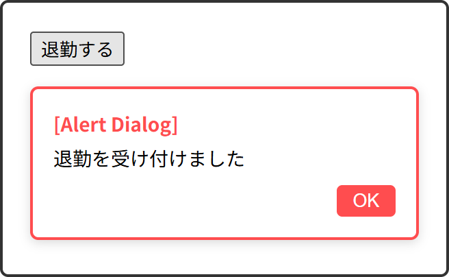

- [クリック]ボタンを押すとアラートが1回表示されること
- HTML属性方式と `addEventListener` 方式の違いを説明できること

## 演習1.4 DOM操作とJavaScriptからのレンダリング

### 演習1.4.1 innerHTMLによる置き換え

**参照テキスト**  
1.4.1. innerHTML プロパティ

**参照ファイル**  
`sample\Ex1-4\innerHTML.html`

**演習ファイル**  
`exercise_question\Ex1-4\innerHTML.html`

まず、動作確認のように実装するためには、どうするべきか考えましょう。どの要素を選択して操作するべきかをまず考えてください。そして置き換えるための要素がどの場所かも考えておきましょう。

1. idが `loadButton` の要素を選択し、変数 `btn` に代入してください。
2. ボタンのclickイベント内で、idが `employeeInfo` の要素を選択してください。
3. 元々「社員情報はまだ読み込まれていません。」と表示される要素を、見出し「社員情報を読み込みました」と社員名「山田太郎」というHTMLに置き換えてください。

#### 動作確認

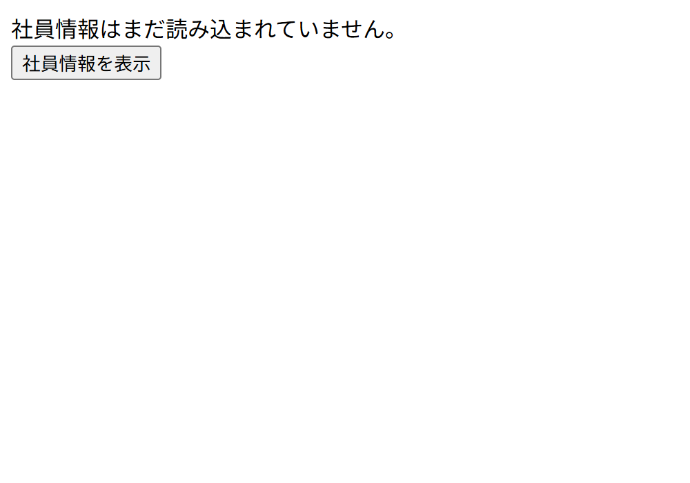
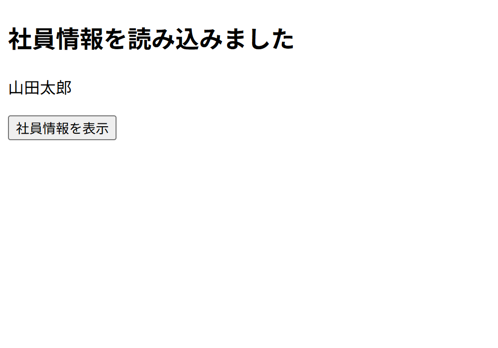

- ボタンを押す前は「社員情報はまだ読み込まれていません。」と表示されること
- ボタンを押すと、指定したHTMLへ置き換わること

### 演習1.4.2 insertAdjacentHTMLによる追加

**参照テキスト**  
1.4.2. insertAdjacentHTML メソッド

**参照ファイル**  
`sample\Ex1-4\insertAdjacentHTML.html`

**演習ファイル**  
`exercise_question\Ex1-4\insertAdjacentHTML.html`

1. 既存の社員一覧テーブル、[社員を追加]ボタン、社員番号を管理する変数の役割を確認してください。
2. ボタンのclickイベント内で、社員一覧の末尾に新しい社員行を追加してください。
3. 挿入位置には `beforeend` を指定してください。
4. 追加する行には社員番号、氏名、勤務地を表示してください。社員番号には `employeeId`、氏名には `employeeName`、勤務地には `locationName` を利用してください。
5. 行追加後に `employeeId` が1増えることを確認してください。

#### 動作確認

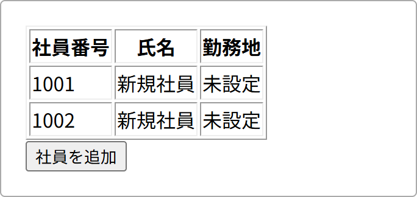

- ボタンを押すたびに、既存の見出し行を消さずにデータ行が1行ずつ追加されること
- 社員番号が1001、1002、1003の順に増えること
- `innerHTML` による置き換えとの違いを説明できること

### 演習1.4.3 classListによるスタイル変更

**参照テキスト**  
1.4.3. classList によるスタイルクラスの動的適用

**参照ファイル**  
`sample\Ex1-4\class_list.html`

**演習ファイル**  
`exercise_question\Ex1-4\class_list.html`

1. 在席中を表すCSSクラス `.working` を完成させてください。
2. 勤務状態の表示要素にid `workStatus` と初期表示用classを指定してください。
3. [出勤]、[退勤]、[状態切替]に、それぞれ識別できるidを指定してください。
4. idが `workStatus` の要素を選択し、変数 `target` に代入してください。
5. [出勤]のclickイベントで `working` クラスを追加してください。
6. [退勤]のclickイベントで `working` クラスを削除してください。
7. [状態切替]のclickイベントで `working` クラスを付け外ししてください。

#### 動作確認

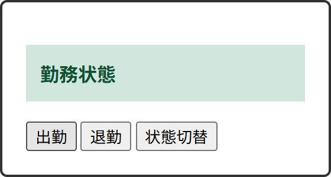

- [出勤]で在席中の表示になること
- [退勤]で離席中の表示へ戻ること
- [状態切替]を押すたびに表示が交互に切り替わること

---

# 演習2 非同期通信

## 演習の目標

- 非同期通信が必要な理由を説明できる
- Fetch APIを使ってGETリクエストを送信できる
- JSON形式のレスポンスをJavaScriptのオブジェクトとして利用できる
- Axiosを使ってURLパラメータを送信できる
- 非同期通信の成功時と失敗時の処理を記述できる

## 演習の概要

人事管理システムの「打刻時刻の取得」と「給与計算」を題材に、ブラウザからExpressのAPIへリクエストを送り、受信したJSONを画面へ表示します。Fetch APIとAxiosの両方を使用し、共通点と記述方法の違いを確認します。

## 予想所要時間

約30分

## 演習2.2 Fetch APIで出勤時刻を取得する

**参照テキスト**  
2.2. Fetch API と、サーバーからの応答

**参照ファイル**  
`sample\Ex2-2\fetch.html`

**演習ファイル**  
`exercise_question\Ex2-2\fetch.html`
- 使用するAPI: `exercise_question\Ex2-2\currenttime-api`

### APIの準備

1. ターミナルで `exercise_question/Ex2-2/currenttime-api` を開いてください。
2. `npm start` または `npm run dev` を実行してください。
3. 起動時に `npm install` が自動実行され、必要な依存関係がインストールされます。
4. ブラウザで `http://localhost:3002/currenttime` を開き、`time` プロパティを持つJSONが返ることを確認してください。

### フロントエンドの実装

1. clickイベント内で、時刻の表示先 `showTime` を選択し、変数 `result` に代入していることを確認してください。
2. `fetch` の送信先に `http://localhost:3002/currenttime` を指定してください。
3. 取得した `response` はJSON形式です。JavaScriptのデータへ変換してください。
4. 受信した `data` をConsoleへ出力してください。
5. Consoleでレスポンスのプロパティ名を確認してください。
6. `result` で選択済みの要素の場所に、`data.time` を「出勤時刻：...」の形式で置き換えてください。
7. 失敗時に `catch` が実行されることを確認してください。

#### 初心者向けヒント

Fetch APIでは、APIから返ってきたレスポンスをそのまま使うのではなく、最初にJSONへ変換します。演習ファイルの空欄は、次の流れになるように埋めてください。

```javascript
fetch(送信先URL)
    .then((response) => response.json())
    .then((data) => {
        console.log(data);
        表示先.innerHTML = `出勤時刻：${data.time}`;
    })
    .catch((error) => console.error(error));
```

`data.time` の `time` は、APIの動作確認で返ってくるJSONのプロパティ名です。まずブラウザで `http://localhost:3002/currenttime` を開き、返ってくる形を確認してから実装してください。

#### 動作確認

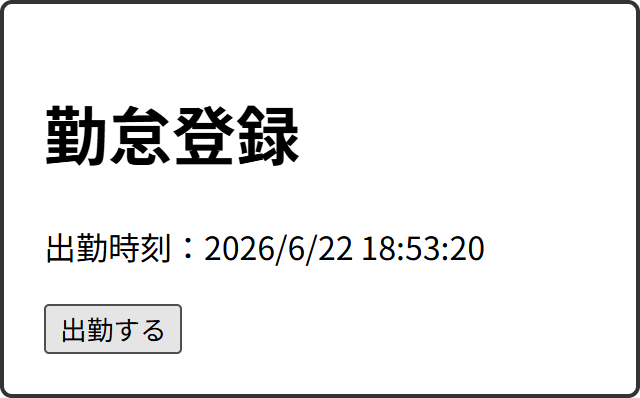

- [出勤する]を押すとAPIから取得した現在時刻が出勤時刻として表示されること
- NetworkでGETリクエストと200レスポンスを確認できること
- APIサーバーを停止した状態ではConsoleにエラーが表示されること

## 演習2.3 Axiosで手取り見込額を取得する

**参照テキスト**  
2.3. axios ライブラリを用いたデータ送信

**参照ファイル**  
`sample\Ex2-2\axios.html`

**演習ファイル**  
`exercise_question\Ex2-2\axios.html`
- 使用するAPI: `exercise_question\Ex2-2\payroll-api`

### APIの準備

1. 給与計算APIのフォルダをターミナルで開いてください。
2. 初回のみ `npm install` を実行してください。
3. `npm start` を実行してください。
4. ブラウザで `http://localhost:3003/payroll/230000` を開き、`salary`、`tax`、`net_salary` を含むJSONが返ることを確認してください。

### フロントエンドの実装

1. 給与入力欄から値を取得してください。
2. AxiosのGETメソッドを使用し、`http://localhost:3003/payroll/${salary}` へリクエストを送信してください。
3. `response.data` をConsoleへ出力してください。
4. レスポンス内の給与、控除額、手取り見込額を画面へ表示してください。

#### 初心者向けヒント

`input type="text"` や `input type="number"` のようなフォームに入力されるデータは、選択した要素の `.value` で取得できます。

```javascript
let salary = document.getElementById("salary").value;
```

この演習では、取得した `salary` をURLの一部として使います。テンプレートリテラルを使うと、次のように変数をURLへ埋め込めます。

```javascript
`http://localhost:3003/payroll/${salary}`
```

#### 動作確認

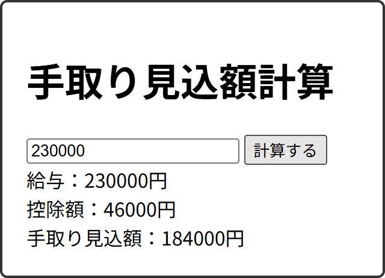

- 給与230,000円を入力すると、給与、控除額、手取り見込額が表示されること
- 別の給与額でもAPIの計算結果が表示されること
- `response` と `response.data` の違いを説明できること

## 演習2.3.1【オプション】AxiosでBMIを取得する

この演習はオプションです。演習2.3まで完了した人が、AxiosのPOSTメソッド、リクエストパラメータ、`response.data`、テンプレートリテラルをもう一度確認するために取り組んでください。

**参照テキスト**

2.3. axios ライブラリを用いたデータ送信

**参照ファイル**

`sample\Ex2-2\axios.html`

**演習ファイル**

`exercise_question\Ex2-2\axios_optional.html`
- 使用するAPI: `exercise_question\Ex2-2\bmi-api`

### APIの準備

1. 給与計算APIを起動している場合は停止してください。このオプション演習のAPIも同じ `3003` 番ポートを使用します。
2. ターミナルで `exercise_question/Ex2-2/bmi-api` を開いてください。
3. 初回のみ `npm install` を実行してください。
4. `npm start` を実行してください。
5. このAPIはPOSTでデータを受け取るため、ブラウザでURLを直接開く確認は行いません。フロントエンド実装後に、Networkで `POST http://localhost:3003/bmi` が送信されることを確認してください。

### フロントエンドの実装

1. `height` と `weight` の入力欄から値を取得してください。
2. AxiosのPOSTメソッドを使用し、`http://localhost:3003/bmi` へリクエストを送信してください。
3. POSTで送信するリクエストパラメータとして、`height` と `weight` をオブジェクトにまとめてください。
4. `response.data` をConsoleへ出力してください。
5. Consoleでレスポンスのプロパティ名が `bmi` と `category` であることを確認してください。
6. `result` の要素のコンテンツを、BMIと判定を表示するHTMLに置き換えてください。
7. 失敗時に `catch` が実行されることを確認してください。

#### 初心者向けヒント

Axiosでは、APIから返ってきたJSONの本文は `response.data` に入ります。まずConsoleで中身を確認してから、どのプロパティを使うか決めてください。

```javascript
console.log(response.data);
```

POSTで複数の値を送信するときは、URLへ値を埋め込むのではなく、第2引数にオブジェクトを渡します。

```javascript
axios.post("http://localhost:3003/bmi", {
    height: height,
    weight: weight,
});
```

`response.data` の中に `bmi` と `category` があることを確認できたら、テンプレートリテラルを使ってHTMLへ埋め込みます。

```javascript
`BMI: ${response.data.bmi}<br>
 判定: ${response.data.category}`
```

#### 動作確認

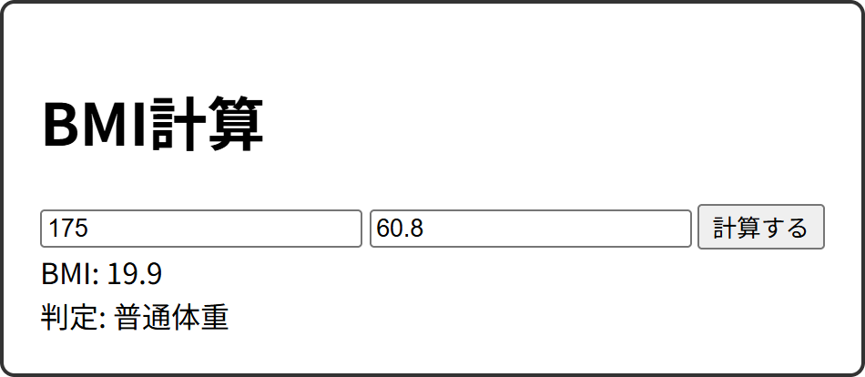

- 身長に `175`、体重に `60.8` を入力すると、BMIが `19.9`、判定が `普通体重` と表示されること
- 別の身長・体重でもAPIの計算結果が表示されること
- Networkで `POST http://localhost:3003/bmi` が送信され、Request Payloadに `height` と `weight` が含まれること
- Consoleで `response.data` の中身を確認できること

## 演習2.4 Fetch APIとAxiosの比較

**参照テキスト**  
2.2. Fetch API と、サーバーからの応答／2.3. axios ライブラリを用いたデータ送信

**参照ファイル**  
`sample\Ex2-2\fetch.html`、`sample\Ex2-2\axios.html`

次の観点で、演習2.2と演習2.3のコードを比較してください。

- ライブラリの読み込みが必要か
- JSON変換を明示的に記述しているか
- レスポンス本体へどのようにアクセスするか
- エラー処理をどこに記述しているか

自分の言葉で、Fetch APIとAxiosの共通点を1つ、相違点を2つ記述してください。

---

# 演習3 REST API

## 演習の目標

- REST APIとHTTPメソッドの対応を説明できる
- ExpressからSQLiteの `employee` テーブルを操作できる
- GET、POST、DELETE、PUTを使って社員情報のCRUD処理を実装できる
- URLパラメータ、クエリパラメータ、リクエストボディを使い分けられる
- APIのレスポンスを使って社員一覧を再描画できる

## 演習の概要

人事管理システムを題材に、ブラウザ、Express、SQLiteを連携させます。社員一覧から始め、氏名検索、登録、削除、更新へ段階的に機能を追加します。

## 予想所要時間

約150分（参考演習を含む）

## 演習3.2 REST APIの環境構築

**参照テキスト**  
3.2.1. REST APIの環境構築

**参照ファイル**  
`sample\Ex3-2\index.html`、`sample\Ex3-2\api\server.js`

**演習ファイル**  
`exercise_question\Ex3-2\index.html`、`exercise_question\Ex3-2\api\server.js`

APIの実装をする前に、Live Serverで現在のHTMLの状態を確認し、どの部分が足りないのかを考えてから実装しましょう。

#### 初心者向けヒント

データベースの中身を確認するときは、次のSELECT文を使います。

```sql
SELECT * FROM employee;
```

1. 準備済みの `employee.db` を開き、`employee` テーブルの中身を確認してください。
2. `employee` テーブルに社員が5名登録されていることを確認してください。
3. `api\server.js` を開き、Express、CORS、JSON受信、SQLite接続が設定済みであることを確認してください。
4. GET `/api/test` が作成済みであることを確認し、APIサーバーを起動してください。
5. ブラウザで `http://localhost:3005/api/test` にアクセスし、APIの動作確認を行ってください。

#### 動作確認

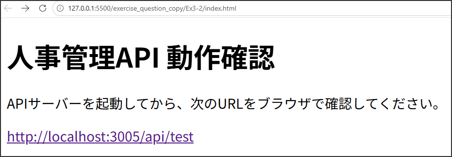
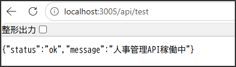

- `/api/test` へアクセスするとJSONが返ること
- SQLiteで `SELECT * FROM employee` を実行すると初期データが表示されること
- CORSと `express.json()` の役割を説明できること

## 演習3.3 社員の検索

### 演習3.3.1 社員一覧の表示

**参照テキスト**  
3.3.1. 初期画面実装(一覧表示)

**参照ファイル**  
`sample\Ex3-3\list.html`、`sample\Ex3-3\api\server.js`

**演習ファイル**  
`exercise_question\Ex3-3\list.html`、`exercise_question\Ex3-3\api\server.js`

APIの実装をする前に、Live Serverで現在のHTMLの状態を確認し、どの部分が足りないのかを考えてから実装しましょう。

#### フロントエンド

1. `list.html` を開き、社員一覧用のtableと、顔写真、社員番号、氏名、給与、勤務地の見出しが配置済みであることを確認してください。
2. `DOMContentLoaded` でGET `http://localhost:3005/api/employees` を呼び出してください。
3. 成功時に `response.data` を社員一覧表示関数へ渡してください。
4. `forEach` とテンプレートリテラルで社員を1名ずつ行に変換してください。顔写真列では `image_path` を使って画像を表示します。
5. `insertAdjacentHTML` でtbodyへ行を追加してください。

#### API

1. GET `/api/employees` を定義してください。
2. `SELECT * FROM employee` を `db.all` で実行してください。
3. 検索結果の配列をJSON形式で返してください。

#### 初心者向けヒント

社員一覧を取得するときは、次のSELECT文を使います。

```sql
SELECT * FROM employee;
```

#### 動作確認

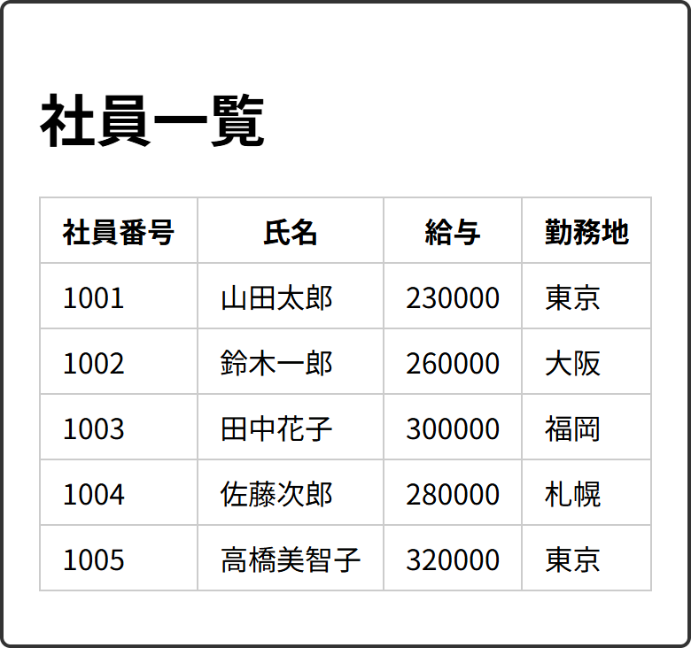

- 初期表示時に全社員が表示されること
- 社員番号、氏名、給与、勤務地が列ずれせず表示されること
- `password` は一覧に表示しないこと

### 演習3.3.2 氏名によるキーワード検索

**参照テキスト**  
3.3.2. キーワード検索機能実装

**参照ファイル**  
`sample\Ex3-3\search_keyword.html`、`sample\Ex3-3\api\server.js`

**演習ファイル**  
`exercise_question\Ex3-3\search_keyword.html`、`exercise_question\Ex3-3\api\server.js`

APIの実装をする前に、Live Serverで現在のHTMLの状態を確認し、どの部分が足りないのかを考えてから実装しましょう。

#### フロントエンド

1. `search_keyword.html` を開き、氏名入力欄と[検索]、[一覧表示]ボタンが配置済みであることを確認してください。
2. [検索]ボタンのクリック時に、入力された検索キーワードを取得してください。
3. [検索]では `http://localhost:3005/api/employees?keyword={入力値}` を呼び出してください。
4. [一覧表示]では、キーワードなしで `http://localhost:3005/api/employees` を呼び出してください。
5. どちらのレスポンスも共通の社員一覧表示関数へ渡してください。

#### API

1. `api\server.js` の【演習3.3.2 手順3】と【手順4】のコメントアウトを外してください。
2. `req.query.keyword` を取得してください。
3. キーワードがない場合は全件検索を実行してください。
4. キーワードがある場合は `name LIKE ?` による部分一致検索へ切り替えてください。
5. プレースホルダーに渡す値の前後へ `%` を付けてください。

#### 初心者向けヒント

キーワードがない場合は全件検索のSELECT文を使います。

```sql
SELECT * FROM employee;
```

キーワードがある場合は、氏名の部分一致検索になるように次のSELECT文を使います。

```sql
SELECT * FROM employee WHERE name LIKE ?;
```

#### 動作確認

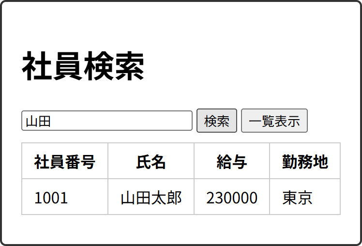

- 「山田」「郎」など氏名の一部で検索できること
- [一覧表示]を押すと全社員へ戻ること
- SQL文字列へ入力値を直接連結していないこと

## 演習3.4 新規社員の登録

**参照テキスト**  
3.4. 新規データ登録

**参照ファイル**  
`sample\Ex3-4\add_data.html`、`sample\Ex3-4\api\server.js`

**演習ファイル**  
`exercise_question\Ex3-4\add_data.html`、`exercise_question\Ex3-4\api\server.js`

APIの実装をする前に、Live Serverで現在のHTMLの状態を確認し、どの部分が足りないのかを考えてから実装しましょう。

### フロントエンド

1. HTMLのフォームのidを確認し、5つの入力値を取得してください。
2. 初期表示時にもGET `http://localhost:3005/api/employees` を呼び出し、社員一覧を表示してください。
3. パスワード、氏名、給与のいずれかが未入力なら、エラーを表示して処理を終了してください。
4. AxiosのPOSTメソッドで `http://localhost:3005/api/employees` を呼び出してください。
5. 5項目をリクエストボディへ設定してください。
6. 登録成功後、顔写真列を含む社員一覧を再取得してください。

### API

1. 初期表示用にGET `/api/employees` を定義し、社員一覧をJSON形式で返してください。
2. POST `/api/employees` を定義してください。
3. `req.body.password` のように、`req.body` から5項目を1つずつ取得してください。
4. `location_name` と `image_path` は、フロントエンドから送られるキー名と一致させて取得してください。
5. 必須項目である `password`、`name`、`salary` が不足している場合は400 Bad Requestを返してください。
6. 次のSQLをプレースホルダー付きで実行してください。

```sql
INSERT INTO employee (password, name, salary, location_name, image_path)
VALUES (?, ?, ?, ?, ?)
```

7. 登録後に社員一覧を取得し、最新の一覧をJSON形式で返してください。

#### 初心者向けヒント

フロントエンドで送るキー名と、API側で受け取るキー名は一致させます。この演習では、次の5項目です。

```javascript
password
name
salary
location_name
image_path
```

画面側の入力欄IDは `locationName` のようなJavaScript向けの名前ですが、APIへ送るオブジェクトではデータベース列名に合わせて `location_name` を使います。

新規登録画面の画像パス入力欄の近くには、コピーして使える入力例として `※ 例: ../images/1001.png` を表示します。placeholderにすると入力時に消えてしまうため、通常のテキストとして表示します。更新画面では既存データの `image_path` を入力欄へ表示するため、この例示は不要です。

```javascript
{
    password: password,
    name: name,
    salary: salary,
    location_name: locationName,
    image_path: imagePath
}
```

サーバー側の必須チェックは、演習ファイルのコメントにある通り `password`、`name`、`salary` の3項目を対象にします。勤務地と画像パスは空でも登録できる扱いです。

初期表示時と登録後の最新一覧を取得するときは、次のSELECT文を使います。

```sql
SELECT * FROM employee;
```

#### 動作確認

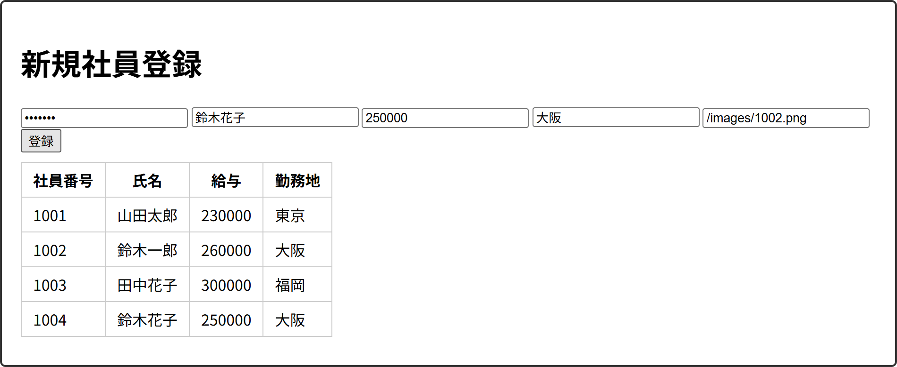

- 正しい値で新しい社員が登録されること
- 未入力では登録されず、エラーが表示されること
- 登録後の一覧に新しい社員が表示されること

## 演習3.5 社員情報の削除

**参照テキスト**  
3.5. データの削除機能の実装

**参照ファイル**  
`sample\Ex3-5\delete.html`、`sample\Ex3-5\api\server.js`

**演習ファイル**  
`exercise_question\Ex3-5\delete.html`、`exercise_question\Ex3-5\api\server.js`

APIの実装をする前に、Live Serverで現在のHTMLの状態を確認し、どの部分が足りないのかを考えてから実装しましょう。

### フロントエンド

1. APIを完全に実装し、初期表示で顔写真列を含む社員一覧が取得できることを確認してください。
2. `showEmployeeList(employees)` の中にある削除ボタンの `onclick` を修正し、削除対象の社員番号を `deleteEmployee` 関数へ渡してください。
3. 確認ダイアログで承認された場合だけDELETE `http://localhost:3005/api/employees/${id}` を呼び出してください。
4. 削除成功後に社員一覧を再取得してください。

### API

1. DELETE `/api/employees/:id` を定義してください。
2. `req.params.id` から社員番号を取得してください。
3. `DELETE FROM employee WHERE id = ?` を実行してください。
4. 削除後に社員一覧を取得し、最新の一覧をJSON形式で返してください。

#### 初心者向けヒント

この演習では、確認ダイアログを表示するために `confirm` を使います。`confirm` はOKが押されると `true`、キャンセルが押されると `false` を返します。

キャンセル時はAPIを呼ばずに処理を終了するため、次のコードは最初から完成済みです。

```javascript
if (!confirm("この社員を削除しますか？")) {
    return;
}
```

削除後の最新一覧を取得するときは、次のSELECT文を使います。

```sql
SELECT * FROM employee;
```

#### 動作確認

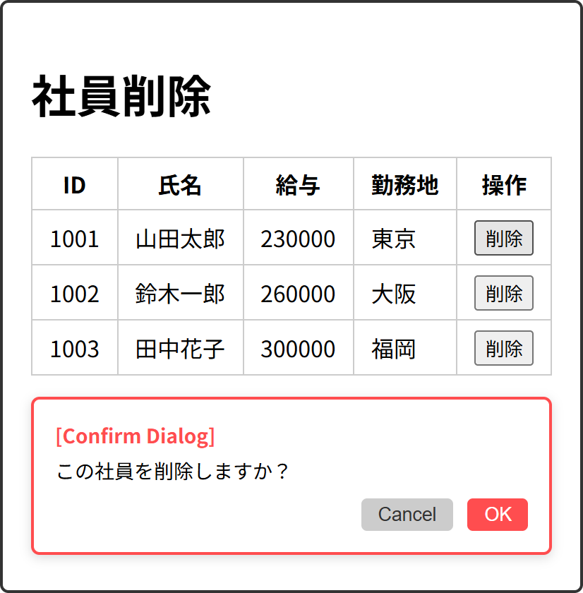
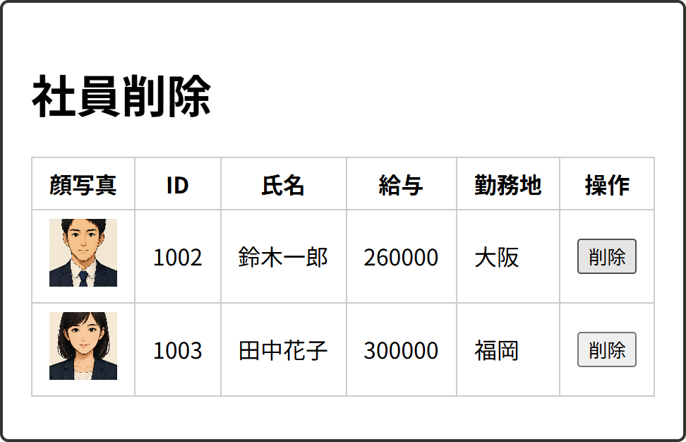

- 選択した社員だけが削除されること
- キャンセルした場合は削除されないこと
- 削除後に返された社員一覧を再描画できること

## 演習3.6 【参考】社員情報の更新

**参照テキスト**  
3.6. 【参考】更新機能の実装

**参照ファイル**  
`sample\Ex3-6\update.html`、`sample\Ex3-6\api\server.js`

**演習ファイル**  
`exercise_question\Ex3-6\update.html`、`exercise_question\Ex3-6\api\server.js`

APIの実装をする前に、Live Serverで現在のHTMLの状態を確認し、どの部分が足りないのかを考えてから実装しましょう。

### フロントエンド

1. `[更新]` ボタンから社員番号を更新フォーム設定関数 `setUpdateForm` へ渡してください。社員一覧には、社員番号の左に顔写真列を表示します。
2. `setUpdateForm(id)` の中で、GET `http://localhost:3005/api/employees/${id}` を呼び出し、対象社員の詳細情報を取得していることを確認してください。
3. 対象社員の現在値をフォームへ表示してください。特に hidden の `updateId` には必ず社員番号を設定します。ここが空だと、更新時にどの社員を更新するか判断できません。パスワードは保存済みの値を表示せず、空欄にします。
4. 更新時はパスワードを含む5項目を取得してください。
5. PUT `http://localhost:3005/api/employees/${id}` を呼び出してください。
6. 更新成功後に社員一覧を再取得してください。

### API

1. GET `/api/employees/:id` を定義してください。
2. `req.params.id` から社員番号を取得してください。
3. `db.get` で、社員番号が一致する1行を取得してください。
4. PUT `/api/employees/:id` を定義してください。
5. `req.params.id` から社員番号を取得してください。
6. `req.body.password` のように、`req.body` から5項目を1つずつ取得してください。
7. 次のSQLをプレースホルダー付きで実行してください。

```sql
UPDATE employee
SET password = ?, name = ?, salary = ?, location_name = ?, image_path = ?
WHERE id = ?
```

8. 更新後に社員一覧を取得し、最新の一覧をJSON形式で返してください。

#### 初心者向けヒント

更新後の最新一覧を取得するときは、次のSELECT文を使います。

```sql
SELECT * FROM employee;
```

更新フォームへ表示する1名分の詳細情報を取得するときは、次のSELECT文を使います。

```sql
SELECT * FROM employee WHERE id = ?;
```

テキストの更新機能の説明では、配列から1名を探すために `find` を使う考え方を学習しました。ただし、更新画面では一覧に表示していない項目も必要になります。たとえばパスワードや画像パスは、一覧だけを見ても完全な詳細情報として扱いにくい項目です。

そのため3.6では、一覧の配列から `find` で探すのではなく、社員番号を使って `GET /api/employees/:id` を呼び出し、データベースから対象社員の詳細情報を1件取得します。更新フォームを作るときは、「一覧データを使い回す」よりも「主キーで詳細を取り直す」ほうが安全です。

#### 動作確認

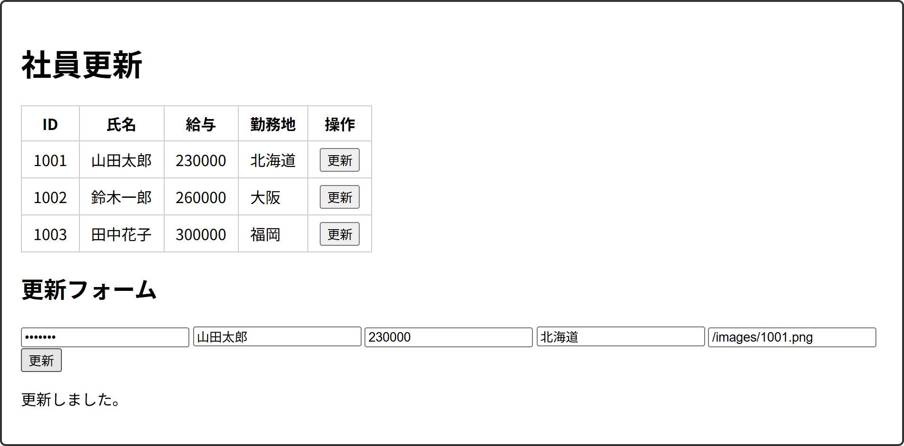

- 一覧の `[更新]` ボタンをクリックすると、更新フォームへ選択した社員の値が表示されること
- パスワード欄は空欄で表示されること
- 氏名、給与、勤務地、画像パスは現在の値が表示されること
- 更新後に一覧とデータベースへ変更が反映されること
- 別の社員が誤って更新されないこと

---

# 演習4 SPA開発

## 演習の目標

- SPAと従来型Webページの違いを説明できる
- Bootstrap Modalへ社員情報を表示できる
- 画面を再読み込みせずに詳細、登録、更新、削除を操作できる
- Navigation APIでURLと表示内容を連動させられる
- JavaScriptモジュールを使って画面表示処理を分割できる

## 演習の概要

第3章の人事管理機能をSPAへ発展させます。共通のヘッダー、サイドメニュー、フッターを残したまま、社員一覧、社員詳細、新規登録などのメイン画面だけを切り替えます。

## 予想所要時間

約120分（参考演習を含む）

## 演習4.2 Modalを使った画面表示

### 演習4.2.1 社員詳細をModalに表示する

**参照テキスト**  
4.2.1. 商品詳細を Modal に表示する

**参照ファイル**  
`sample\Ex4-2-1\index.html`、`sample\Ex4-2-1\api\server.js`

**演習ファイル**  
`exercise_question\Ex4-2-1\index.html`、`exercise_question\Ex4-2-1\api\server.js`

> 参照テキストは商品情報を扱っていますが、本演習では社員情報へ置き換えます。使用する仕組みは、APIで1件を取得してModalへ表示する点で同じです。

APIの実装をする前に、Live Serverで現在のHTMLの状態を確認し、どの部分が足りないのかを考えてから実装しましょう。

1. 社員詳細Modalへid `detailModal` を指定してください。
2. 社員番号、氏名、給与、勤務地、社員画像の表示先にidが指定されていることを確認してください。
3. 一覧の氏名をリンクにし、クリック時に社員番号を詳細表示関数へ渡してください。
4. GET `http://localhost:3005/api/employees/${id}` を呼び出してください。
5. 取得した社員情報をModalへ表示してください。
6. 既に、イメージ関連はソースコードに記述済みなので、その部分のソースコードを確認するようにしてください。
7. BootstrapのModalインスタンスを作成し、表示してください。

#### API

1. GET `/api/employees/:id` を定義してください。
2. `SELECT * FROM employee WHERE id = ?` を `db.get` で実行してください。
3. 対象がない場合は404、見つかった場合は社員1名を返してください。

#### 動作確認

- 氏名をクリックしてもページ全体が再読み込みされないこと
- クリックした社員とModalの内容が一致すること
- パスワードがModalへ表示されないこと

### 演習4.2.2 【参考】社員登録をModal化する

**参照テキスト**  
4.2.2. 【参考】登録機能の Modal 化

**参照ファイル**  
`sample\Ex4-2-2\index.html`、`sample\Ex4-2-2\api\server.js`

**演習ファイル**  
`exercise_question\Ex4-2-2\index.html`、`exercise_question\Ex4-2-2\api\server.js`

APIの実装をする前に、Live Serverで現在のHTMLの状態を確認し、どの部分が足りないのかを考えてから実装しましょう。

1. [新規社員登録]ボタンの `data-bs-target` には `#registerModal`、登録Modal本体の `id` には `registerModal` を指定してください。
2. Modal内に5項目の入力欄、画像パスの入力例 `※ 例: ../images/1001.png`、[登録]ボタンが配置されていることを確認してください。
3. POST `http://localhost:3005/api/employees` で社員情報を送信してください。
4. 登録成功後、顔写真列を含む社員一覧を再取得し、Modalを閉じてください。
5. 入力欄とエラーメッセージを初期状態へ戻してください。

#### 初心者向けヒント

登録Modalで使うidは、開くボタンの `data-bs-target` とModal本体の `id` を対応させます。この演習では、後続のコードで `registerModal` を使ってModalを閉じるため、必ずModal本体のidを `registerModal`、ボタン側を `data-bs-target="#registerModal"` にしてください。

登録APIは第3章のPOST処理と同じ考え方です。`exercise_question\Ex4-2-2\api\server.js` では、第3章で作った登録APIを参考にし、必須チェックも含めてコピーしてください。画像パスは `image_path` として送信します。

登録後にModalを閉じる処理は、次の形です。

```javascript
bootstrap.Modal.getInstance(document.getElementById('registerModal')).hide();
```

`getInstance` には、閉じたいModal本体のDOM要素を渡します。

#### 動作確認

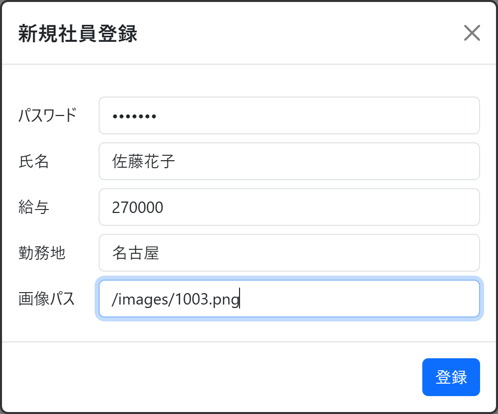

- 画面遷移せずに社員を登録できること
- 未入力時はModalを閉じず、エラーを表示すること

### 演習4.2.3 【参考】更新・削除をModal化する

**参照テキスト**  
4.2.3. 【参考】更新・削除機能の Modal 化

**参照ファイル**  
`sample\Ex4-2-3\index.html`、`sample\Ex4-2-3\api\server.js`

**演習ファイル**  
`exercise_question\Ex4-2-3\index.html`、`exercise_question\Ex4-2-3\api\server.js`

APIの実装をする前に、Live Serverで現在のHTMLの状態を確認し、どの部分が足りないのかを考えてから実装しましょう。

1. 社員詳細Modalへ[編集]と[削除]を配置してください。
2. 編集Modalへ現在の社員情報を設定してください。特に hidden の更新用IDには必ず社員番号を設定し、パスワードは空欄にします。
3. PUT `http://localhost:3005/api/employees/${id}` で更新してください。
4. DELETE `http://localhost:3005/api/employees/${id}` で削除してください。
5. 成功後は対象Modalを閉じ、社員一覧を再取得してください。

#### 初心者向けヒント

更新処理は、次の順番で考えると整理しやすくなります。

1. 詳細APIで取得した社員情報を、詳細Modalと更新Modalの両方へ設定する。更新Modalでは氏名、給与、勤務地、画像パスを現在値として入れ、パスワードは空欄にする。
2. 更新ボタンを押したら、更新Modalの入力値を読み取る。
3. `axios.put` で `http://localhost:3005/api/employees/${id}` へ送る。
4. 成功したら `showEmployeeList(response.data)` で一覧を再描画する。
5. `updateModal` を `hide()` で閉じる。

削除処理は、詳細Modalに表示している社員番号を使います。

1. `detailId` から社員番号を取得する。
2. `axios.delete` で `http://localhost:3005/api/employees/${id}` を呼び出す。
3. 成功したら一覧を再描画する。
4. `detailModal` を閉じる。

Modalを閉じる時は、`bootstrap.Modal.getInstance(document.getElementById('Modalのid')).hide()` の形を使います。

#### 動作確認

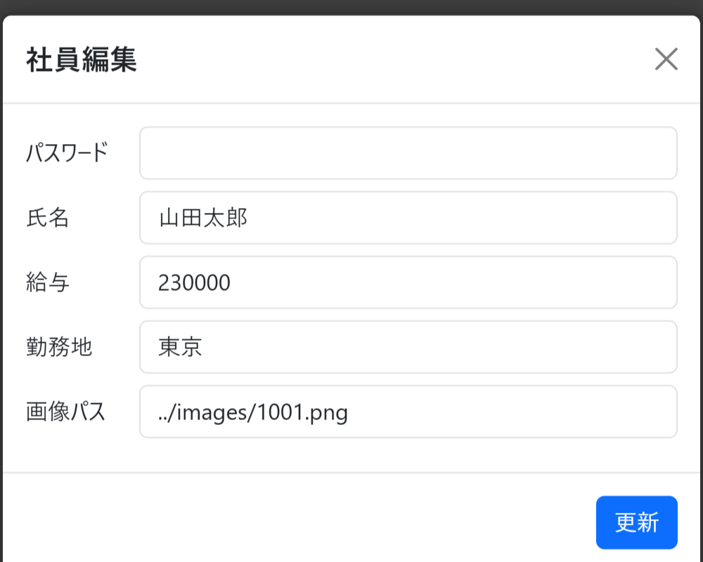

- 編集Modalに選択社員の現在値が表示されること。パスワードは空欄、氏名、給与、勤務地、画像パスは現在の値が表示されること
- 更新・削除後に一覧が正しく更新されること

## 演習4.3 Navigation APIを活用したSPA

### 演習4.3の動作確認方法

演習4.3は、URLのパス（`/employees` など）を読み取って表示画面を切り替えるSPAです。`/employees/new` のようなURLへ直接アクセスするには、サーバー側で `index.html` を返す設定が必要です。この演習では、APIサーバーがHTMLも配信します。

動作確認では、次の手順でAPIサーバーを起動し、ブラウザのアドレス欄へURLを直接入力してください。

1. `exercise_question\Ex4-3\api` で `npm run dev` または `npm start` を実行し、APIサーバーを起動してください。`index.html` もこのサーバーから配信されます。
2. ブラウザのアドレス欄へ、確認したいURLを直接入力してください。

例:

- `http://localhost:3005/`

完成解答を確認する場合は、`exercise_sample\Ex4-3\api` で同じ手順を実行してください。

### 演習4.3.1 ルートと画面を対応させる

**参照テキスト**  
4.3. Navigation APIを活用した本格 SPA（擬似遷移）

**参照ファイル**  
`sample\Ex4-3\index.html`

**演習ファイル**  
`exercise_question\Ex4-3\index.html`

実装を進める前に、APIサーバーから現在の画面を開き、どのURLでどの表示が足りないのかを確認してから実装しましょう。

`showPage(path)` は、現在のURLのパスを受け取り、どの画面表示関数を呼び出すかを決める関数です。リンクをクリックした時も、ブラウザのアドレス欄へURLを直接入力した時も、この関数を通して同じ画面切り替え処理を実行します。

次のURLと表示内容を `showPage(path)` で対応させてください。

| URL | 表示画面 | 表示関数 |
|---|---|---|
| `/` | ホーム | `showHome` |
| `/employees` | 社員一覧 | `showEmployeeList` |
| `/employees/new` | 新規社員登録 | `showEmployeeRegister` |
| `/employees/{id}` | 社員詳細 | `showEmployeeDetail` |

1. `DOMContentLoaded` で現在のパスに対応する画面を表示してください。
2. `navigation` のnavigateイベントを受け取ってください。
3. 同一オリジンでintercept可能な移動だけを処理してください。
4. `event.intercept` 内で `showPage` を呼び出してください。
5. `showPage(path)` の中で、`/`、`/employees`、`/employees/new` に対応する表示関数を呼び出してください。
6. 社員詳細のURLから社員番号を取り出す正規表現は完成済みなので、`result[1]` に社員番号が入ることを確認してください。

#### 初心者向けヒント

Navigation APIでは、リンククリックや戻る・進むなどの移動を `navigate` イベントで受け取ります。演習ファイルの空欄は、次の形を目安にしてください。

```javascript
document.addEventListener("DOMContentLoaded", function () {
    showPage(window.location.pathname);
});

navigation.addEventListener("navigate", function (event) {
    let url = new URL(event.destination.url);

    const canIntercept = url.origin === location.origin;
    if (!canIntercept) {
        return;
    }

    event.intercept({
        handler() {
            showPage(url.pathname);
        },
    });
});
```

`showPage(path)` の中では、単純なURLは `if (path === "/employees")` のように比較します。穴埋めでは、どのURLにどの表示関数を割り当てるべきかを意識してください。

```javascript
function showPage(path) {
    if (path === "/" || path === "/index.html") {
        showHome();
        return;
    }
    if (path === "/employees" || path === "/employees/") {
        showEmployeeList();
        return;
    }
    if (path === "/employees/new" || path === "/employees/new/") {
        showEmployeeRegister();
        return;
    }
}
```

社員詳細のように番号が変わるURLは、正規表現で取り出します。この部分は演習ファイルに完成済みのコードとして用意しているため、穴埋めではなく動きを確認してください。

```javascript
let result = path.match(/^\/employees\/(\d+)$/);
if (result) {
    showEmployeeDetail(result[1]);
    return;
}
```

`result[1]` には、`/employees/1001` の `1001` が入ります。

#### 動作確認

- ブラウザのアドレス欄に `http://localhost:3005/` を直接入力し、ホーム画面が表示されること
- ブラウザのアドレス欄に `http://localhost:3005/employees` を直接入力し、顔写真列を含む社員一覧が表示されること
- ブラウザのアドレス欄に `http://localhost:3005/employees/new` を直接入力し、新規社員登録画面が表示されること
- ブラウザのアドレス欄に `http://localhost:3005/employees/1001` を直接入力し、社員詳細と顔写真が表示されること
- URLが変わっても共通レイアウトが残ること
- [戻る]と[進む]で画面が正しく切り替わること
- 社員一覧から詳細へ再読み込みなしで移動できること

### 演習4.3.2 【オプション】新しいルートを追加する

**参照テキスト**  
4.3. Navigation APIを活用した本格 SPA（擬似遷移）

**参照ファイル**  
`sample\Ex4-3\index.html`

**演習ファイル**  
`exercise_question\Ex4-3\index.html`

この問題は穴埋めではなく、4.3.1で作ったルーティング処理を使って、新しい画面を自分で追加するオプション演習です。

次の仕様で「このシステムについて」画面を追加してください。

- URL: `/about`
- メニュー名: このシステムについて
- 表示内容: システム名と使用技術を3つ以上
- 表示関数名: `showAbout`

追加する時は、次の3点をそろえます。

1. ナビゲーションに `/about` へのリンクを追加する。
2. `showAbout` 関数を作成し、表示したいHTMLを `app` に入れる。
3. `showPage(path)` に `/about` の分岐を追加し、`showAbout()` を呼び出す。

#### 動作確認

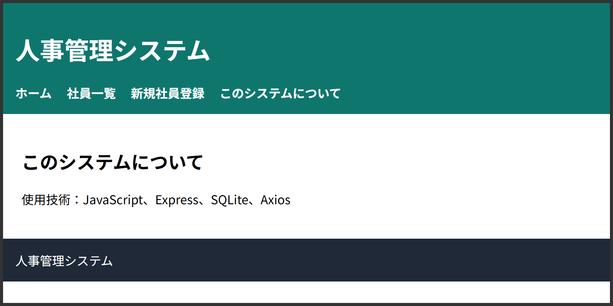

- メニューの「このシステムについて」またはブラウザのアドレス欄に `http://localhost:3005/about` を直接入力した際、上の画像のようにシステム概要および使用技術が表示されること

## 演習4.4 【参考】コンポーネント化

### 演習4.4の動作確認方法

演習4.4も演習4.3と同じく、URLのパスを読み取って画面を切り替えます。`index.html` を直接開くのではなく、APIサーバーからHTMLを配信してURLを直接入力してください。

1. `exercise_question\Ex4-4\api` で `npm run dev` または `npm start` を実行し、APIサーバーを起動してください。`index.html` と `js` フォルダもこのサーバーから配信されます。
2. ブラウザのアドレス欄へ、確認したいURLを直接入力してください。

例:

- `http://localhost:3005/`
- `http://localhost:3005/employees`
- `http://localhost:3005/employees/new`
- `http://localhost:3005/employees/1001`

完成解答を確認する場合は、`exercise_sample\Ex4-4\api` で同じ手順を実行してください。

### 演習4.4.1 モジュールへ分割する

**参照テキスト**  
4.4. 【参考】コンポーネント化

**参照ファイル**  
`sample\Ex4-4\index.html`、`sample\Ex4-4\js\app.js`、`sample\Ex4-4\js\components`

**演習ファイル**  
`exercise_question\Ex4-4\index.html`、`exercise_question\Ex4-4\js`

実装を進める前に、APIサーバーから現在の画面を開き、コンポーネント化する前後でどの表示や操作が足りないのかを確認してから実装しましょう。

次の構成を参考に、画面表示処理を分割してください。

```text
js/
├─ app.js
└─ components/
   ├─ home.js
   ├─ employee-list.js
   ├─ employee-detail.js
   ├─ employee-register.js
   ├─ employee-update-modal.js
   └─ employee-delete-modal.js
```

1. `index.html` から `app.js` を `type="module"` で読み込んでください。
2. 各表示関数を対応ファイルから `export` してください。
3. `app.js` で必要な関数を `import` してください。
4. `app.js` には画面遷移とルート判定の責務を残してください。
5. `employee-list.js` では、社員番号の左に顔写真列を表示してください。
6. `employee-register.js` では、画像パス入力欄の近くに `※ 例: ../images/1001.png` を表示してください。
7. `employee-update-modal.js` では、画像パスを現在値として入力欄へ表示してください。更新画面では既存データが入るため、画像パス例や画像プレビューは不要です。

#### 初心者向けヒント

`import` / `export` は、別ファイルの関数を使うための仕組みです。関数を外部から使えるようにする側では、関数宣言の前に `export` を付けます。

```javascript
export function showHome() {
    // 画面を表示する処理
}
```

読み込む側では、関数名を `{}` の中に書き、相対パスでファイルを指定します。

```javascript
import { showHome } from './components/home.js';
```

名前は完全に一致させます。`showHome` と `showhome` は別名として扱われるため、大小文字にも注意してください。

オブジェクトを外部へ出す場合は、次のように `export const` を使います。

```javascript
export const employeeRegister = {
    render() {
        // HTMLを返す処理
    },
    init() {
        // イベント登録の処理
    },
};
```

画面遷移で使う `navigation.navigate('/employees')` は指定したURLへ移動し、`navigation.reload()` は現在のURLの画面をもう一度表示します。

#### 動作確認

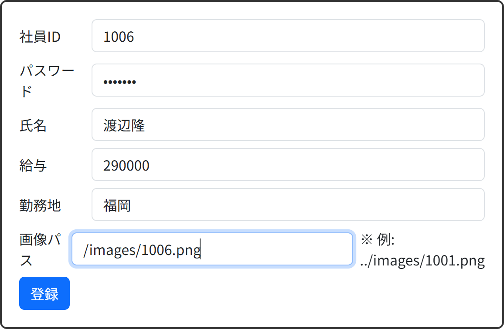
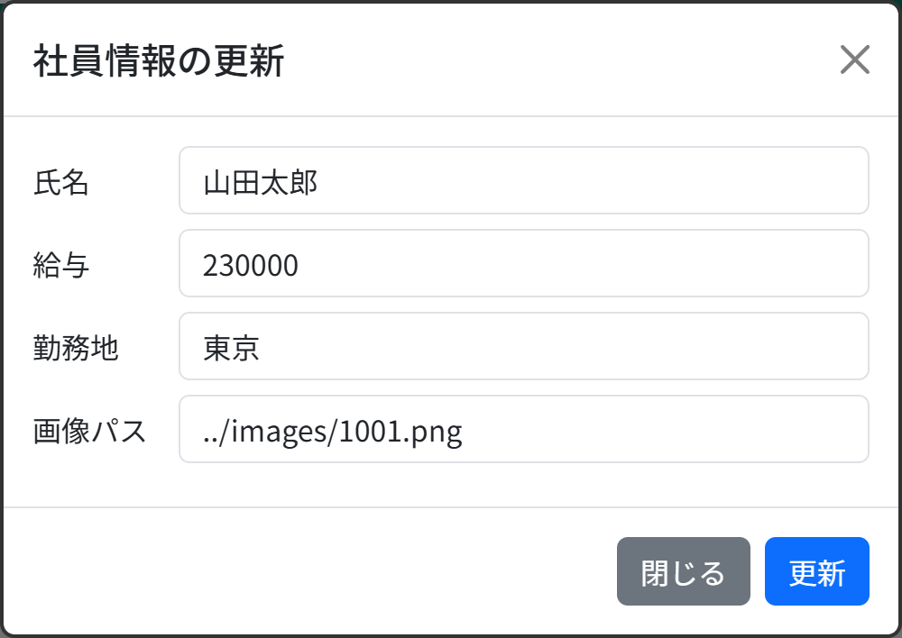

- 登録画面は、ブラウザのアドレス欄に `http://localhost:3005/employees/new` を直接入力して確認すること
- 更新モーダルは、ブラウザのアドレス欄に `http://localhost:3005/employees/1001` を直接入力し、社員詳細画面の更新ボタンから確認すること
- 社員一覧は、ブラウザのアドレス欄に `http://localhost:3005/employees` を直接入力し、顔写真列も含めて確認すること

